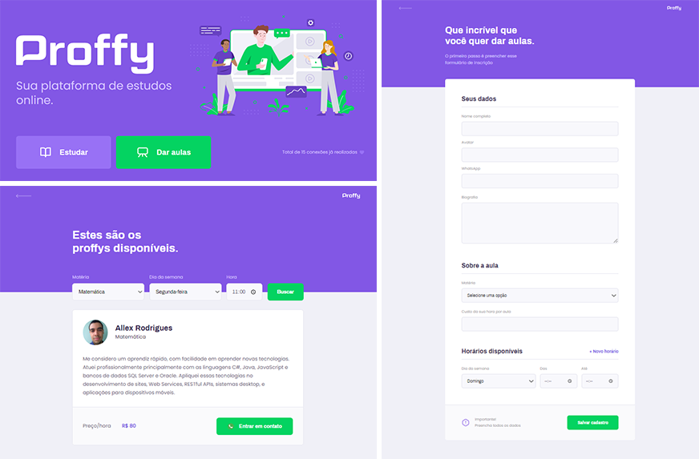
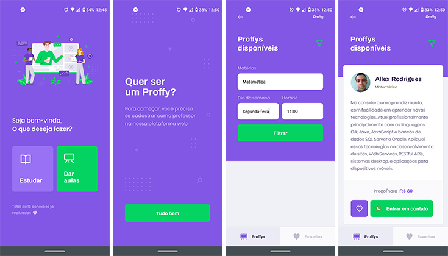

Plataforma para conectar professores e alunos. Desenvolvido durante a Next Level Week #2 com a Rocketseat.

### Screenshots

#### Web
<p align="center">
  
</p>

#### Mobile (Android)
<p align="center">
  
</p>

### Como rodar?

Existem 3 módulos:
- **server**: backend do sistema, contruído com [Node.js](https://nodejs.org/);
- **web**: front-end web, construído com [React](https://reactjs.org);
- **mobile**: front-end mobile, contruído com [React Native](https://reactnative.dev/) e [Expo](https://expo.io/);

```shell
git clone https://github.com/FusRoDah061/proffy-nlw.git

# Subindo backend
cd proffy-nlw/server
yarn install
npm run knex:migrate
yarn start

# Acesse a API em http://localhost:3333/

# Subindo front-end web
cd proffy-nlw/web
yarn install
yarn start

# Acesse o front-end em http://localhost:3000/

# Subindo expo para acessar front-end mobile
cd proffy-nlw/mobile
yarn install
yarn start

# Acesse http://localhost:19002/ e leia o QRCode com o app do Expo
```
